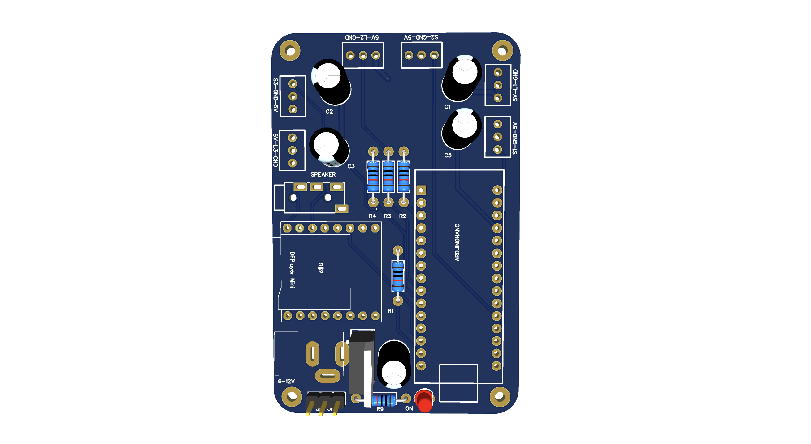
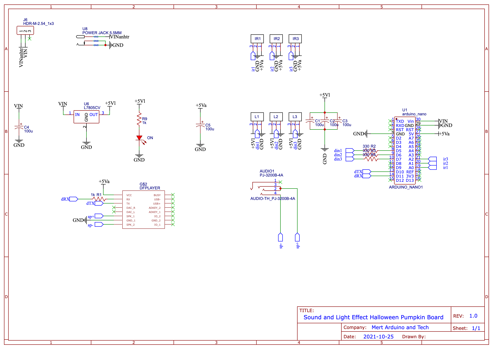

# Halloween Pumpkin with Sound and Light Effects
Halloween is close and I wanted to make a related cool project. Of course, it will involve a pumpkin. Also I wanted to add some electronics, of course. For that, inside we have an Arduino connected to a few other parts. For light effects, I’m using an addressable controlled LED strip. For sound we have a mp3 module and to detect movement a PIR sensor. The scary pumpkin will stay powered off till it detects movement. Once it detects that somebody is close, it will run a few random loops such and play scary sounds. Also changing lights colors and blinking.     
    
# Video Tutorial Step by Step
For that, inside we have an Arduino connected to a few other parts. For light effects, I’m using an addressable controlled LED strip. For sound we have a mp3 module and to detect movement a PIR sensor. The scary pumpkin will stay powered off till it detects movement. Once it detects that somebody is close, it will run a few random loops such and play scary sounds. Also changing lights colors and blinking.     
  
Please subscribe ❤️ For all lovers of #Arduino #Electronics and #Robotics    
# Get PCB Prototype
You can easily build the circuit on a breadboard, I also converted the breadboard circuit into a professional prototype. If you want to avoid a complicated circuit, you can get 10 PCBs for just $5 from the link below. All components used are easy to find and solderable. This prototype allows you to control up to 3 pcs LED strips with 3 different sensors (such as IR, PIR and HC-SR04).  
Get 10 PCBs for Only $5 https://www.pcbway.com    
    
# Parts for Breadboard Circuit & PCB Prototype
LED Strip: https://bit.ly/2DkYdmQ - https://amzn.to/3dCSBTl  
MP3 Player: https://bit.ly/2BVgNAU - https://amzn.to/3weAzPy  
Microcontroller: https://bit.ly/2QO5m2g - https://amzn.to/39sAs9g  
Adapter: https://bit.ly/3bkEwrS - https://amzn.to/39y3Ivl  
Voltage Regulator: https://bit.ly/37ptKi4 - https://amzn.to/3dpxFia  
Speaker: https://bit.ly/2YwSJMe - https://amzn.to/3wg1CKs  
Capacitor: https://bit.ly/30BaNYr - https://amzn.to/39qPEDS  
Resistor: https://bit.ly/2MUegJC - https://amzn.to/3sEsQbv  
Toggle Switch: https://bit.ly/2B4ADcs - https://amzn.to/3fyZnMe  
Soldering Tools: http://bit.ly/2Kbr9hQ - https://amzn.to/3dgwCRO  
# Circuit diagram of Breadboard and PCB
    
